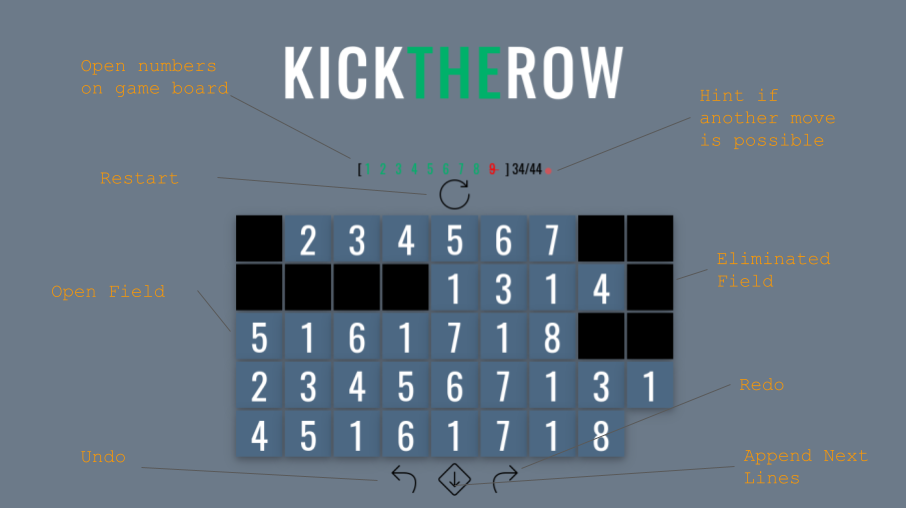

# kick-the-row



Is a [Vue](https://vuejs.org/) implementation of the number game "numberama/ten-pair/take ten" and co.
Purpose was mainly to learn vue.

Similar implementations are:
    
- https://play.google.com/store/apps/details?id=com.kila.zahlenspielpro.lars&hl=de&gl=US
- http://www.playonlinedicegames.com/numberama
- https://www.logicgamesonline.com/tenpair/

## Requirements

- node and npm
- python2 for node-gyp

## Getting Started

``` bash
# get the project
git clone https://github.com/keilWolf/kick-the-row

# go into the project directory
cd kick-the-row

# install dependencies
npm install

# serve with hot reload at localhost:8080
npm run dev

# build for production with minification
npm run build
```

For detailed explanation on how things work, consult the [docs for vue-loader](http://vuejs.github.io/vue-loader).

## Testing

``` bash
npm run test
```

## Further Improvements

The project is just a basic implementation. For the future, i have the following improvements in mind:

- intro page (how to play the game)
- highscore (1, 2, 3)
- different playing modes (easy, hard)

### Playing modes

#### Easy or Optional Stuff

- Highlights and Hints

#### Hard

- Time; after a certain time new lines will come.
- no undo redo 

## Author

Wolfram Keil